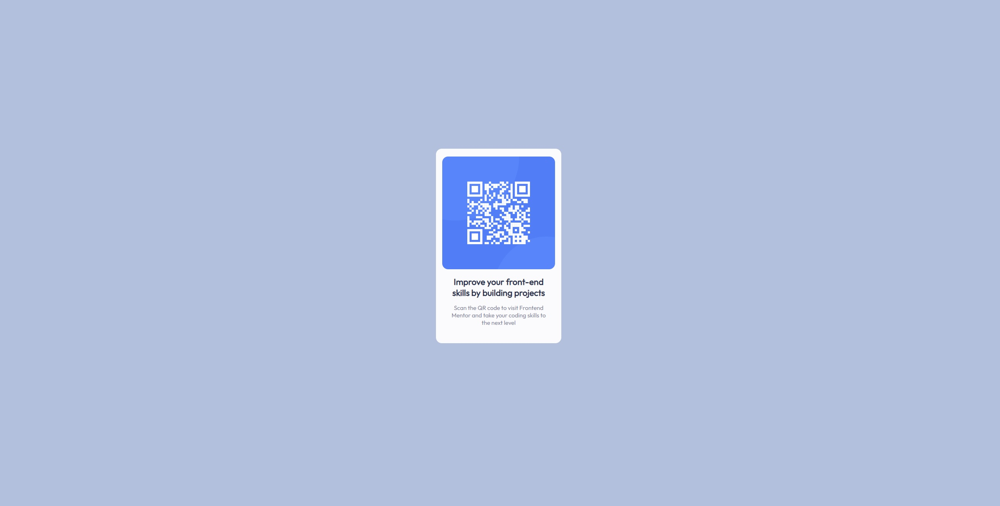

# Frontend Mentor - QR code component solution

This is a solution to the [QR code component challenge on Frontend Mentor](https://www.frontendmentor.io/challenges/qr-code-component-iux_sIO_H). Frontend Mentor challenges help you improve your coding skills by building realistic projects. 

## Table of contents

- [Overview](#overview)
  - [Screenshot](#screenshot)
  - [Links](#links)
- [My process](#my-process)
  - [Built with](#built-with)
  - [What I learned](#what-i-learned)
  - [Continued development](#continued-development)
- [Acknowledgments](#acknowledgments)

**Note: Delete this note and update the table of contents based on what sections you keep.**

## Overview

### Screenshot

### Links

- Solution URL:(https://github.com/Nazemrap/Frontend_Mentor.io)
- Live Site URL:(https://nazemrap.github.io/Frontend_Mentor.io/)

## My process

### Built with

With the help of VCS Studio
- HTML5
- CSS

### What I learned

How to use github, i think i passed more time to understand how to upload and especially make a live site due to a problem in the deploying. I figured out that in the css there was one ";"missing.  
By using "root" you HAVE to name your html "index"  
with just that two change it passed from full red to full green. 

Otherwise, the "main" difficulty i got was to import and use a new font-familly ( The order in which you put the link matter more than i thought in the heading.)  
And aligning the box to the borders.

### Continued development

I mainly got some trouble to align the white square to the borders. I found a way to do it, but it might not be the most efficient. 

## Acknowledgments

I added a little bonus of mouse-over to the Qr code just for fun and try something 
